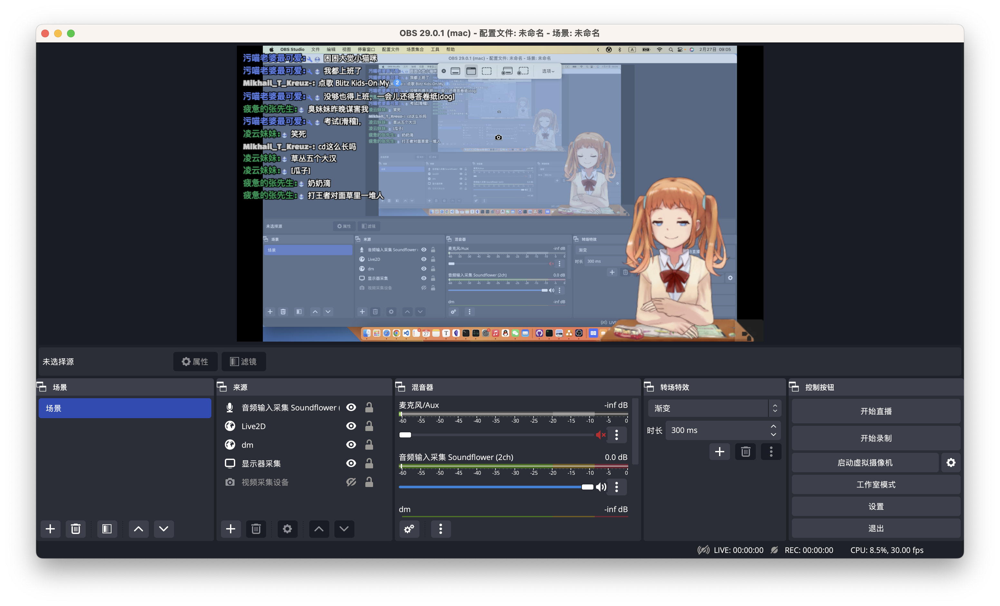
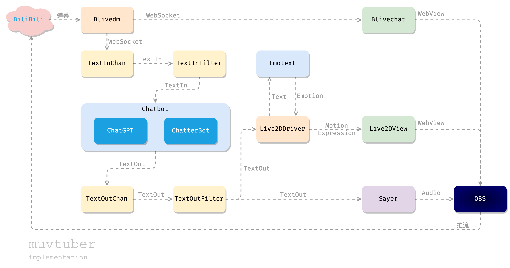

# muvtuber

[README in English](README-EN.md)

Makes your AI vtuber.

> 让 AI 成为虚拟主播：看懂弹幕，妙语连珠，悲欢形于色，以一种简单的实现



- 不定期的测试直播：http://live.bilibili.com/26949229
- QQ 交流群：569686683
- 介绍文章：[知乎 - 写个AI虚拟主播：看懂弹幕，妙语连珠，悲欢形于色，以一种简单的实现](https://zhuanlan.zhihu.com/p/609878670)
- We're currently developing this project for the Chinese Bilibili platform. We're still working on integrating it with YouTube, Twitch, and other platforms. Stay tuned for updates, and we welcome your contributions.

[TOC]

## 项目构成




| 服务                                                         | 说明                                                         | 基于                                                         |
| ------------------------------------------------------------ | ------------------------------------------------------------ | ------------------------------------------------------------ |
| [blivechat](https://github.com/cdfmlr/blivechat/tree/muvtuber) | 获取直播间弹幕消息。                                         | [xfgryujk/blivechat](https://github.com/xfgryujk/blivechat) |
| [Live2dView](https://github.com/cdfmlr/live2dview)           | 前端：显示 [Live2D](https://www.live2d.com/en/) 模型         | [guansss/pixi-live2d-display](https://github.com/guansss/pixi-live2d-display) |
| [Live2dDriver](https://github.com/cdfmlr/live2ddriver)       | 驱动前端 Live2D 模型动作表情                                 | -                                                            |
| [ChatGPTChatbot](https://github.com/cdfmlr/chatgpt_chatbot)  | 基于 [ChatGPT](https://chat.openai.com) 的优质聊天机器人     | [acheong08/ChatGPT](https://github.com/acheong08/ChatGPT)    |
| [MusharingChatbot](https://github.com/cdfmlr/musharing_chatbot) | 基于 [ChatterBot](https://github.com/gunthercox/ChatterBot) 的简单聊天机 | [RaSan147/ChatterBot_update](https://github.com/RaSan147/ChatterBot_update) <br/> [musharing-team/chatbot_api](https://github.com/musharing-team/chatbot_api) |
| [Emotext](https://github.com/murchinroom/emotext)                 | 中文文本情感分析                                             | [cdfmlr/murecom-verse-1](https://github.com/cdfmlr/murecom-verse-1) |
| [externalsayer](https://github.com/cdfmlr/externalsayer)     | 调用公开的 API （external API）进行 TTS 文本语音合成。       | [Azure: TTS](https://azure.microsoft.com/zh-cn/products/cognitive-services/text-to-speech/) |
| [audioview](https://github.com/cdfmlr/audioview)             | 基于 Web 的音频播放。用于从 docker 中输出音频到 OBS          | -                                                            |
| [muvtuberdriver](https://github.com/cdfmlr/muvtuberdriver)   | 组装各模块，驱动整个流程                                     | -                                                            |

非服务模块：

| 模块 | 说明 |
| ---- | ---- |
| [muvtuber-proto](https://github.com/cdfmlr/muvtuber-proto)   | proto 定义                             |
| [sayerapigo](https://github.com/murchinroom/sayerapigo) | Go 语言的 Sayer (TTS) 接口服务端+客户端框架 |
| [chatbotapipy](https://github.com/murchinroom/chatbotapipy) | Python 语言的 Chatbot API 服务端框架    |


## 快速开始

v0.3.0 版本已实现了完全 Docker 化，所以应该支持任意常用操作系统了。现在只需要几个命令即可启动整个项目：

0. 安装 Docker 以及 Docker Compose。

1. 拉取代码：

```sh
# 拉取代码
git clone --recursive https://github.com/cdfmlr/muvtuber.git
cd muvtuber
```

⚠️  由于使用了 git 子模块，一定要递归拉取。不能下载 zip，或不带 `--recursive` 参数的 clone。

🚧 默认的 main 分支是开发中的最新版本，不保证能运行。请使用打了 tag 个版本：[点这里](https://github.com/cdfmlr/muvtuber/tags)。

2. 修改配置：（详见 [配置详解](#配置详解)）

```sh
vim docker-compose.yml
# 按照你的实际情况修改 HTTP_PROXY、HTTPS_PROXY 的值
# 如果不需要，直接删掉就行。

vim configs/externalsayer/config.yaml
# 配置 TTS 文本语音合成: 
# 配置 azure 语音合成服务的 key、region 和 role (SSML 模板)

vim configs/muvtuberdriver/config.yaml
# 主程序的配置:
# 你的房间号（roomid）、ChatGPT 的 apiKey 以及 initialprompt.
# 各种 server 的地址都不用改，已经配合 docker-compose.yml 设好了.
```

3. 启动服务：

```sh
docker compose up -d      # 自动下载或构建、启动各种服务

# docker compose ps       # 查看服务状态
# docker compose logs -f  # 查看日志（Ctrl+C 停止）
```

- 可以直接从 Docker Hub 拉取镜像啦 🎉
    - 在 v0.3.5 中，加入了 CI 机制。所有 Docker 镜像均由 GitHub Actions 自动构建，并推送到 Docker Hub （ [murchinroom/xxx](https://hub.docker.com/u/murchinroom)）。
    - 镜像较多，请保持网络通畅。在较差的网络情况下测试（校园网直连 Docker Hub），需要约 252.4s 拉取全部镜像。
- 亦可在本地自行构建各种镜像：
    - 请确保网络环境能访问 Docker Hub 和 GitHub.
    - 在中国大陆或其他网络环境受限的地区，请使用 `Dockerfile`。其他地区推荐使用 `gh.Dockerfile`。
- 请保证至少有 1 GB 可用硬盘空间。
- 如果遇到问题，可以先看一看 [Troubleshooting](#Troubleshooting)。

4. 配置 OBS，开始直播：（下面三个都是新建浏览器源）
   - 主播 Live2DView：`http://localhost:51070/#/?driver=ws://localhost:51071/live2d`
   - 语音 AudioView：`http://127.0.0.1:51082/?controller=ws://127.0.0.1:51081/`
   - 弹幕 Blivechat：先用浏览器打开 http://localhost:51060，按需配置，然后复制粘贴链接和样式。

## 配置详解

### 网络环境配置

If you can access ChatGPT (api.openai.com) directly, please remove all lines about `HTTP(S)_PROXY` in the `doccker-compose.yml` and skip following steps.

如果你的网络环境不好，直连 GitHub 和 ChatGPT 有困难，就需要做一些代理配置。

> 预先条件：你拥有一个可以让网络变好的魔法道具（行业黑话：代理）。

在你的代理设置中（可能还藏的比较深，如高级设置中），可以找到类似「本机 http 监听端口」之类的值，下面假设这个值为 `http://0.0.0.0:1000`。

接下来根据你的实际情况：

1. 你使用 Docker Desktop：
   - 在 Docker Desktop 里 Settings -> Resources -> Proxies 设置代理地址（宿主机以太网下的本地 IPv4 地址+代理软件设置的端口）
   - 把 `doccker-compose.yml` 文件中的有关 proxy 的内容注释掉或删除。
   
   （这个方法在 Windows 和 macOS 下验证可用，详见 [#51](https://github.com/cdfmlr/muvtuber/issues/51#issuecomment-1579220195) 和 [#30](https://github.com/cdfmlr/muvtuber/issues/30) 的讨论，感谢 [@RAINighty](https://github.com/RAINighty) 和 [@JackChow6](https://github.com/JackChow6) 的帮助。）

2. 你使用 Docker 服务器环境或 Colima 之类的其他容器运行环境：
   - `docker-compose.yml` 中：

   ```yaml
     chatgpt_chatbot:
       ...
       environment:
         - HTTP_PROXY=http://host.docker.internal:1000
         - HTTPS_PROXY=http://host.docker.internal:1000
   ```

   请按照自己的实际情况，替换掉端口号 `1000`。也有可能需要将 `host.docker.internal` 修改为容器眼里宿主机的 IP，具体要看你的运行时是否为你提供了一个容器访问宿主的域名或地址。如果你发现操作中有困难无法解决，建议尝试 Docker Desktop。

### externalsayer 配置详解

> 这里将配置使用免费、高质量的 Azure 的 TTS 服务。（目前也只支持这一种。）
> 该服务的介绍: 
> https://azure.microsoft.com/zh-cn/products/cognitive-services/text-to-speech/

这一块的配置在 `configs/externalsayer/config.yaml` 中：

```yaml
SrvAddr: "localhost:50010"
EnabledSayer: "azure"
AzureSayer:
  SpeechKey: "your-key"
  SpeechRegion: "eastus"
  FormatMicrosoft: "audio-16khz-32kbitrate-mono-mp3"
  FormatMimeSubtype: "mp3"
  Roles:
    "default": '<speak version="1.0" xml:lang="zh-CN"><voice name="zh-CN-XiaoxiaoNeural">{{.}}</voice></speak>'
```

你需要更改：SpeechKey, SpeechRegion 以及 Roles。

- SpeechKey, SpeechRegion： 你在 Azure 上申请的 TTS 服务的 key 和 region。
   - 具体的申请流程可以参考文档：[快速入门：将文本转换为语音](https://learn.microsoft.com/zh-CN/azure/cognitive-services/speech-service/get-started-text-to-speech)
- Roles：`<voice name="xx-XX-Xxx">`这里的 name 应该填写 voice，即“发音人”的名字。具体的列表可以通过以下命令获取：

```sh
curl https://eastus.tts.speech.microsoft.com/cognitiveservices/voices/list --header 'Ocp-Apim-Subscription-Key: xxx'
```

我把请求的结果格式化放到了这个文件里，方便查找：[`externalsayer/azuresayer/voices
/voices-list.json`](https://github.com/cdfmlr/externalsayer/blob/23e32a07de224d6ac19cf3aee0575a3e81e9836a/azuresayer/voices/voices-list.json)。

你可以在网页上的「[Speech Studio](https://aka.ms/speechstudio/voicegallery)」里试听、选择声音。然后在文件里找到对应 voice 的 `"ShortName": "xx-XX-Xxx"` 填写到 `<voice name="xx-XX-Xxx">`。

🌟 更推荐的一种方式是，在「[Speech Studio](https://aka.ms/speechstudio/voicegallery)」中随便写点内容，选择声音让它说，并微调各种参数，满意之后，把 SSML 导出出来，把内容替换为 `{{.}}`，去掉换行（我写了个脚本帮助做这件事，[可以点这里找到](https://github.com/cdfmlr/externalsayer/tree/23e32a07de224d6ac19cf3aee0575a3e81e9836a/azuresayer/voices)）写到配置里。

###  OBS 配置详解

给新手的 OBS 配置详解：

- 虚拟形象（Live2DView）：来源 > `+` > 浏览器 > 新建 > URL: http://localhost:9000/#/
  - 注意把「通过 OBS 控制音频」勾上哦，然后把那条声音关掉，不然有机会听到可爱捏鬼畜日语。
- 弹幕框（blivechat）：来源 > `+` > 浏览器 > 新建 > URL: 
  - 先用浏览器打开 http://localhost:12450
  - 首页 > 房间号：设置为你的房间号 > 进入房间
  - 弹出的窗口 -> 拷贝地址
  - 粘贴到 OBS 的 URL
- 主播说话的音频（audioview）：
  - 来源 > `+` > 浏览器 > 新建 > URL
  - 填入 `http://127.0.0.1:51082/?controller=ws://127.0.0.1:51081/`
  - 建议把「通过 OBS 控制音频」勾上，方便按需调节音量。
- 其他音频（BGM）：来源 > `+` >音频输入采集 > 新建 > 设备：BlackHole 2ch
  - 要先安装一个虚拟声卡，这里以 mac 系统使用 [BlackHole](https://github.com/ExistentialAudio/BlackHole) 为例。
  - 在开始直播前，控制中心 > 声音> 右边 AirPlay 图标 > 选 BlackHole。
  - 然后电脑输出的声音就会 -> BlackHole -> OBS。
- B 站推流：设置（Preferences）> 直播 > 服务：选 `Bilibili Live ...`，推流码填「B 站首页 > 头像 > 推荐服务 > 直播中心 > 左侧“我的直播间”> 填好直播分类、房间标题 > 开始直播，然后会显示的串流密钥」

## Troubleshooting 

暂无。

## 配置开发环境

目前仍不支持用 docker 作为开发环境。需要在本地开发，然后 docker 构建部署。

 -1. 本地开发环境：

```sh
$ uname -mrs
Darwin 22.3.0 arm64
# 目前 TTS 模块还依赖于 macOS，其他系统可能不行。
$ go version  
go version go1.20.1 darwin/arm64
$ python3 --version
Python 3.9.16  # blivechat
Python 3.10.10 # others
$ poetry --version
Poetry (version 1.4.0)
$ node --version
v18.14.2
$ pyenv --version
pyenv 2.3.14
$ pnpm --version
7.29.0
```

Node.js 和 Python 的包管理配置：

```sh
# 前端统一使用 pnpm (珍爱硬盘，远离 npm)
pnpm config set auto-install-peers true -g
# python统一使用 pyenv + poetry
poetry config virtualenvs.prefer-active-python true
poetry config virtualenvs.in-project true  # 只是个人的保守偏好
```

0. 现在可用 git submodule 一次性拉取整个项目，无需手动 clone 各个模块了:

```sh
git clone --recursive https://github.com/cdfmlr/muvtuber.git
```

接下来编译运行各个模块，可以预先开 7 个终端页，然后：

1. [blivechat](https://github.com/cdfmlr/blivechat/tree/muvtuber)

```sh
cd blivechat

# 编译前端
cd frontend
pnpm install
pnpm run build
cd ..

# 运行服务
pyenv local 3.9.16
poetry install
poetry run python main.py
# 服务运行在 http://localhost:12450，会自动在默认浏览器打开
```

2. [Emotext](https://github.com/cdfmlr/emotext)

```sh
cd emotext

pyenv local 3.10.10
poetry install
poetry run python emotext/httpapi.py --port 9003
# emotext server: http://localhost:9003
```

3. [ChatGPTChatbot](https://github.com/cdfmlr/chatgpt_chatbot)

```sh
cd chatgpt_chatbot

pyenv local 3.10.10
poetry install
poetry run python chatgpt
# ChatGPTChatbot gRPC server: localhost:50052
```

4. [MusharingChatbot](https://github.com/cdfmlr/musharing_chatbot)

```sh
cd musharing_chatbot

pyenv local 3.10.10
poetry install
poetry run python -m spacy download en_core_web_sm  # 一个执行不到的依赖，但是不装跑不起来。
PYTHONPATH=$PYTHONPATH:. poetry run python musharing_chatbot
# MusharingChatbot gRPC server: localhost:50051
```


5. [Live2dDriver](https://github.com/cdfmlr/live2ddriver)

```sh
#git clone https://github.com/cdfmlr/live2ddriver.git
cd live2ddriver

go run . -shizuku localhost:9004 -verbose
# live2d shizuku driver: localhost:9004
# websocket message forwarder: localhost:9001 # 前端会连这个

# 不开发该模块也可以 build 出来再运行
```

6. [Live2dView](https://github.com/cdfmlr/live2dview)

```sh
#git clone https://github.com/cdfmlr/live2dview.git
cd live2dview

pnpm install
pnpm exec quasar dev
# 浏览器访问: 调试(戏)页: http://localhost:9000/#/debug
# 生产环境: OBS 添加浏览器源: http://localhost:9000/

# 如果不开发这个模块可以 build & serve:
pnpm exec quasar build
httpstatic -d dist/spa/ -l :9000  # 你的某种静态网页服务工具，如 python -m http.server，如果开发环境最好有宽松的 CROS。这里用的是 https://github.com/cdfmlr/tools/#httpstatic
```

7. [audioview]()

```sh
cd audioview

pnpm install
pnpm run dev
# pnpm run build
```

8. [externalsayer](https://github.com/cdfmlr/externalsayer)

```sh
cd externalsayer

go run . -h
```

9. [muvtuberdriver](https://github.com/cdfmlr/muvtuberdriver)

muvtuberdriver 必须在前面所有服务正确启动后才能启动，否则会 panic 退出。

```sh
#git clone https://github.com/cdfmlr/muvtuberdriver.git
cd muvtuberdriver

go run . -c config.yaml
# chatgpt_access_token: 浏览器访问https://chat.openai.com/api/auth/session获取
# roomid 你的 b 站直播间 id，https://live.bilibili.com/000000?... 中的000000

# 不开发该模块也可以 build 出来再运行
```

10. OBS

```sh
brew install obs
# 或：https://obsproject.com

# 启动 OBS，设置：
# - blivechat 的弹幕框：localhost:12450/...
# - Live2DView：localhost:9000
# - 音频（say）的输出：你使用的音频设备
# 【开始直播】
```

### 本地构建镜像

> 从 v0.3.5 开始，本项目各个服务模块均采用 GitHub Actions 自动完成镜像构建、推送，终端用户直接从 Docker Hub 拉取镜像即可。

如果出于开发或其他理由，需要手动构建镜像的话：

```sh
cd muvtuberdriver   # 或其他服务
docker build -t cdfmlr/muvtuber-muvtuberdriver:v0.0.12-alpha.0 .
```

- ⚠️ The default `Dockerfile` is designed for Chinese mainland users. Please use `gh.Dockerfile` instead if you are in other regions.
- 💥 构建 musharing_chatbot 镜像时如果出现 ProxyError，或者 `Cannot connect to proxy: Name or service not known.`，之类的网络代理问题，请参考 [#网络环境配置] 修改 musharing_chatbot/Dockerfile 中的代理设置。这个东西必须访问 GitHub，如果你的网络环境不允许直接访问 GitHub，可以使用代理。


然后在 `docker-compose.yml` 里将对应镜像修改成新构建镜像的 tag 即可。

## 部署

> 使用前文的 docker compose 方式部署。不再提供散装微服务的部署文档了。

## FAQ

**我（个人/商业/以及任意情况）可以使用这个项目嘛？**

- 可以。在 MIT 协议下开放源代码，没有任何限制。
  - Permissions：✅ Commercial use ✅ Modification ✅ Distribution ✅ Private use
  - Limitations：❌ Liability ❌ Warranty

**在 Microsoft Windows 系统中可以运行嘛？**

- 可以。v0.3.0 完成了完全 Docker 化，只要宿主机能装 docker 就行：所有服务都跑在容器中，所有客户端都是浏览器（可以嵌入 OBS）。

**作者寻求合作嘛？**

- ✅ 你要和我一起写代码（贡献）
- ✅ 你要给我钱让我写我想写的东西（捐赠）
- ❌ 你要给我钱让我写你想要的东西（外包）
  - 非常抱歉，我的时间精力和能力有限。


**为何如此复杂？|| 这个项目的意义是什么？**

- Just for fun.

## TODO

- [Issues](https://github.com/cdfmlr/muvtuber/issues)
- [project-muvtuber](https://github.com/users/cdfmlr/projects/3)

## 开放源代码

所有下属项目除非特别说明，一律在 MIT 协议下开放源代码。

欢迎任何有关 Issue 问题、PR 贡献以及讨论。

